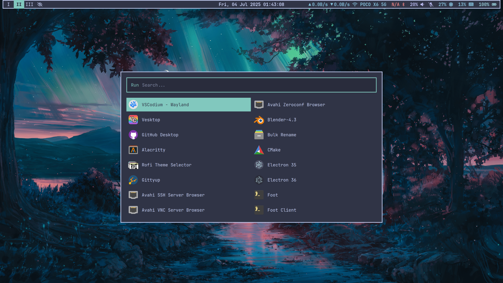
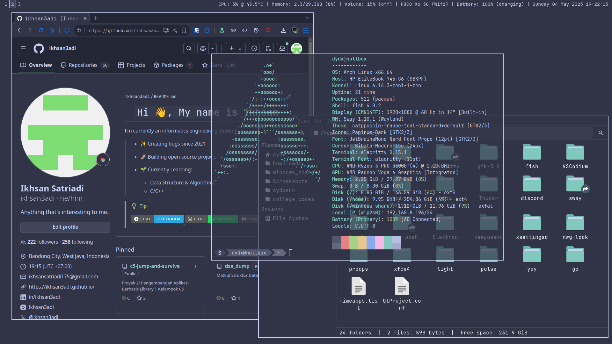

# [My](https://github.com/ikhsan3adi) Dotfiles


|                           |                           |
| :-----------------------: | :-----------------------: |
|  |  |

My Simple Archlinux (& Windows 11) Desktop Config Files 🍚

> _Applicable to other distros beside Archlinux aswell_

|                       | App/Program Used                                                                                                                                                                      |
| :-------------------- | :------------------------------------------------------------------------------------------------------------------------------------------------------------------------------------ |
| Window Manager        | [Sway](https://swaywm.org/)                                                                                                                                                           |
| Launcher              | [rofi-wayland](https://github.com/lbonn/rofi)                                                                                                                                         |
| Lockscreen            | [swaylock-effects](https://github.com/mortie/swaylock-effects)                                                                                                                        |
| Status Bar            | [waybar](https://github.com/Alexays/Waybar)                                                                                                                                           |
| Network               | [networkmanager](https://archlinux.org/packages/?name=networkmanager)                                                                                                                 |
| Brightness            | [light](https://gitlab.com/dpeukert/light)                                                                                                                                            |
| Screen Output Utility | [wlr-randr](https://gitlab.freedesktop.org/emersion/wlr-randr)                                                                                                                        |
| Audio                 | [pulseaudio](https://www.freedesktop.org/wiki/Software/PulseAudio/)                                                                                                                   |
| Audio Visualizer      | [cava](https://github.com/karlstav/cava)                                                                                                                                              |
| Clipboard             | [wl-clipboard](https://github.com/bugaevc/wl-clipboard)                                                                                                                               |
| Notification          | [mako](https://github.com/emersion/mako)                                                                                                                                              |
| Screenshot            | [grim](https://gitlab.freedesktop.org/emersion/grim) \w [slurp](https://github.com/emersion/slurp)                                                                                    |
| Terminal              | [Alacritty](https://github.com/alacritty/alacritty) & [Windows Terminal](https://github.com/microsoft/terminal)                                                                       |
| Shell                 | [Fish](https://fishshell.com/) & [PowerShell 7](https://github.com/PowerShell/PowerShell)                                                                                             |
| Shell Prompt          | [oh-my-posh](https://ohmyposh.dev/)                                                                                                                                                   |
| Terminal Visuals      | [fastfetch](https://github.com/fastfetch-cli/fastfetch/), [tty-clock](https://github.com/xorg62/tty-clock), [cmatrix](https://github.com/abishekvashok/cmatrix), pipes.sh & many more |
| Code Editor           | [VSCodium](https://vscodium.com/) \w [Catppuccin Frappé Theme](https://marketplace.visualstudio.com/items?itemName=Catppuccin.catppuccin-vsc-pack)                                    |
| Browser               | [Zen Browser](https://zen-browser.app/), [Thorium Browser](https://thorium.rocks/)                                                                                                    |
| File Manager          | [Thunar](https://docs.xfce.org/xfce/thunar/start)                                                                                                                                     |
| GTK settings editor   | [nwg-look](https://github.com/nwg-piotr/nwg-look)                                                                                                                                     |
| GTK theme             | [Catppuccin Frappé GTK](https://github.com/catppuccin/gtk/blob/main/docs/USAGE.md)                                                                                                    |
| Folders Icon          | Papirus-Dark \w [Catppuccin Frappé Papirus Folders](https://github.com/catppuccin/papirus-folders)                                                                                    |
| Cursor                | [Bibata](https://github.com/ful1e5/Bibata_Cursor)                                                                                                                                     |
| Font                  | [JetBrainsMono Nerd Font](https://www.nerdfonts.com/font-downloads), [Font Awesome](https://archlinux.org/packages/extra/any/otf-font-awesome/)                                       |
| Color Palette         | (Mostly) [Catppuccin Frappé](https://catppuccin.com/palette/)                                                                                                                         |
| Wallpaper             | <https://wallhaven.cc/w/6ljyd6>, <https://wallhaven.cc/w/5g22q5>                                                                                                                      |

## Install

Choose one of the following method:

### A. Instal manually by copying or symlinking to your config path

```sh
# symlink sway configs
ln -s $(pwd)/sway ~/.config

# symlink wallpaper
mkdir -p ~/Pictures
ln -s $(pwd)/images/wallpaper.png ~/Pictures/wallpaper.png

# other configs aswell ...
```

### B. Using install script to use `alacritty`, `fish`, `oh-my-posh`, `sway` & other configs

> [!CAUTION]
> _**This may override your previous config!**_
>
> ```sh
> chmod +x ./install.sh
> ./install.sh
> ```
