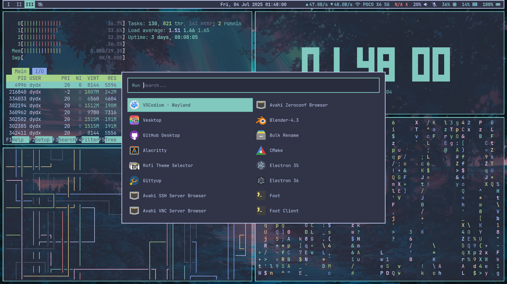

# [My](https://github.com/ikhsan3adi) UNIX Desktop's Dotfiles




My Simple Archlinux Desktop Config Files 🍚

> _Applicable to other distros beside Archlinux aswell_

|                | App/Program Used                                                                                                                                   |
| :------------- | :------------------------------------------------------------------------------------------------------------------------------------------------- |
| Window Manager | [Sway](https://swaywm.org/)                                                                                                                        |
| Launcher       | [wmenu](https://github.com/dixonwille/wmenu)                                                                                                       |
| Lockscreen     | [swaylock-effects](https://github.com/mortie/swaylock-effects)                                                                                     |
| Brightness     | [light](https://gitlab.com/dpeukert/light)                                                                                                         |
| Audio          | [pulseaudio](https://www.freedesktop.org/wiki/Software/PulseAudio/)                                                                                |
| Clipboard      | [wl-clipboard](https://github.com/bugaevc/wl-clipboard)                                                                                            |
| Screenshot     | [grim](https://gitlab.freedesktop.org/emersion/grim) \w [slurp](https://github.com/emersion/slurp)                                                 |
| Terminal       | [Alacritty](https://github.com/alacritty/alacritty)                                                                                                |
| Shell          | [Fish](https://fishshell.com/)                                                                                                                     |
| Shell Prompt   | [oh-my-posh](https://ohmyposh.dev/)                                                                                                                |
| Code Editor    | [VSCodium](https://vscodium.com/) \w [Catppuccin Frappé Theme](https://marketplace.visualstudio.com/items?itemName=Catppuccin.catppuccin-vsc-pack) |
| Browser        | [Thorium Browser](https://thorium.rocks/)                                                                                                          |
| File Manager   | [Thunar](https://docs.xfce.org/xfce/thunar/start)                                                                                                  |
| Font           | [JetBrainsMono Nerd Font](https://www.nerdfonts.com/font-downloads)                                                                                |
| Color Palette  | (Mostly) [Catppuccin Frappé](https://catppuccin.com/palette/)                                                                                      |

## Install

Choose one of the following method:

### A. Instal manually by copying or symlinking to your config path

```sh
# symlink sway configs
ln -s $(pwd)/sway ~/.config

# symlink wallpaper
mkdir -p ~/Pictures
ln -s $(pwd)/images/wallpaper.png ~/Pictures/wallpaper.png

# other configs aswell ...
```

### B. Using install script to use `alacritty`, `fish`, `oh-my-posh`, & `sway` configs

> [!CAUTION]
> _**This may override your previous config!**_
>
> ```sh
> chmod +x ./install.sh
> ./install.sh
> ```
